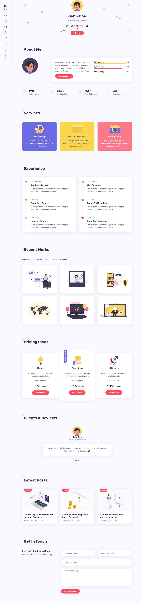

# john doe portfolio

A portfolio website from [React Portfolio Website Tutorial From Scratch part 1](https://youtu.be/o3IP5HeFRO0?si=OOL7Ci35ow-I0VlG), [React Portfolio Website Tutorial From Scratch part 2](https://youtu.be/9wdErl1gA4E?si=NtfFARKJirgfen1q)

## Tech Stack

**Client:** React

## Run Locally

Clone the project

```bash
  git clone https://github.com/hafezfhmi/john-doe-portfolio.git
```

Go to the project directory

```bash
  cd john-doe-portfolio
```

Install dependencies

```bash
  npm install
```

Start the server

```bash
  npm run start
```

## Screenshots



## Demo

https://john-doe-portfolio.hafezfhmi.com
